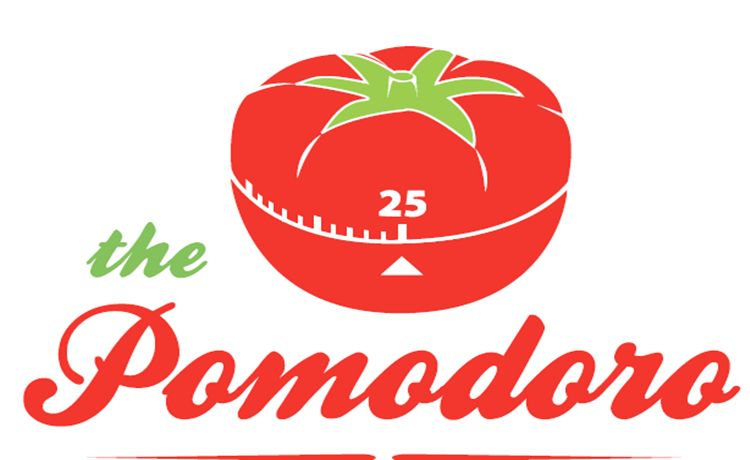
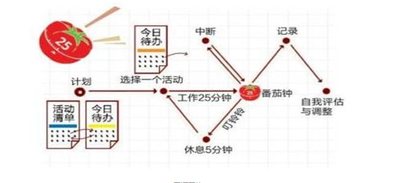
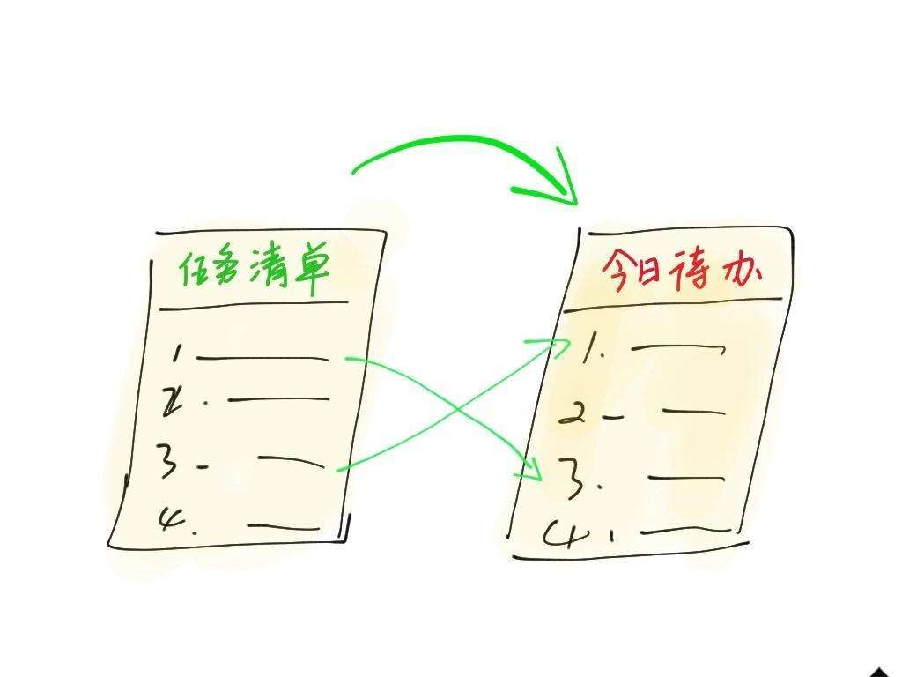
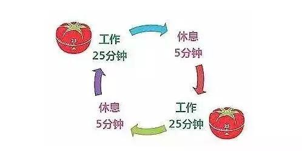
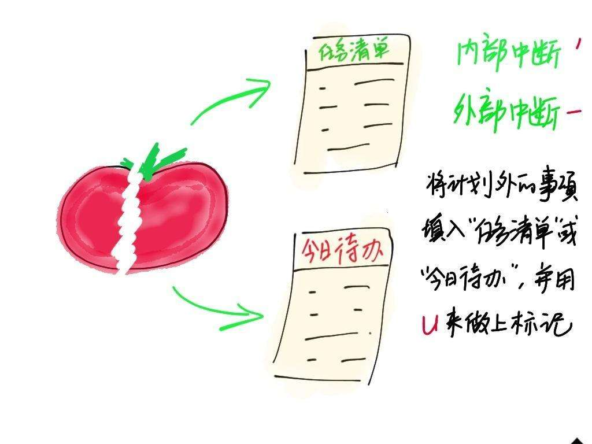

  

# 番茄时间管理法介绍 Introduction of the Pomodoro Technique

> 本次介绍的主要内容
番茄管理法试图解决的一些问题
使用番茄管理法--基础
使用番茄管理法--进阶

## 番茄管理法试图解决的一些问题
* 面对复杂，望而却步
* 无聊琐事，越拖越久
- 小事忙活一天，大事一样没办
- 最后期限，步步紧逼
- 一错再错，不长记性
 

### 番茄管理法的历史

> 弗朗西斯科·西里洛(意大利人)在1992年创立了番茄工作法。他在大学时苦于效率低下，作业做不出来，学习学不进去。最终找到了一枚厨房定时器，形状好像番茄(即意大利语的Pomodoro)。

## 使用番茄管理法--基础
  

    
  

  
**活动清单**
  无论是否重要，不必考虑重要程度和优先级，也不必写出具体做法，只写完成后的状态，可以在后面标注最后期限。
  
  > 清单示例 
    >*  学习Java
    >*  学习番茄工作法图解
    >*  看世界杯
    >*  健身

**今日待办**
  

    
  

  "今日待办"表格是在时间段内限定的承诺。在这张表格中，只让你看到今天可以达到的目标。
  事项的重要程度应该
  活动清单里的事情，别一股脑都抄到"今日待办"表格里，要考虑全部做完的承诺是否合理。  

   
  
   
  
**开始番茄时钟循环**
在明确了今日待办之后，就可以开始设定一个25分钟的定时器。
  

    
  

**工作**
在一个番茄时钟内，保持专注。
不要在番茄钟进行中切换到另一项活动。
**关键不在于当前活动是否能在当前番茄钟内完成，而是在这一刻尽了全力**
完成后在今日待办相应的活动旁边画一个X

**休息**
在休息期间，思考上一个番茄钟或者下一个番茄钟的工作是不允许的。
  > 推荐
  >* 睡觉
  >* 溜达
  >* 喝水
  >* 看窗外

  > 不要  
  >* 打电话
  >* 看新闻
  >* 回电邮
  >* 工作

## 使用番茄管理法--进阶
### 中断

即使一个番茄时钟只有25分钟，仍然会有干扰将我们所专注的工作打断。
#### 避免LIFO和BPUF
1. LIFO: Last-In-First-Out. 
**总是**处理最后冒出来的事情
2. BPUF: Big Plan Up Front. 
**总是**处理大计划内的事情而不顾其他的事情
> 利用活动清单和今日待办来解决这个问题  

#### 中断策略

  

    
  

如果任务被放下了，无论是暂时的还是长期的，当前番茄钟都必须作废。既不能算数，也不应该画X。要开始一个新的25分钟番茄钟替代它。如果需要，可以先休息一下再开始。
不要把几个被打断的番茄钟合并成一个25分钟的番茄钟。
> **原因**
> 1. 失去了25分钟一个番茄钟的节奏
> 2. 容易屈服于诱惑(如果可以累加，遇到什么都中断)

#### **内部中断**
  直觉向心智发出信号，告诉自己去做当前专注活动以外的事情。
  
  > 我的番茄钟经常是这样：
    开启番茄钟开始专注一项活动；然后我渴了/饿了；然后想起来衣服还没洗/晾；想起今天还没上过163；想起王者荣耀的每日任务还没做等等。 

  * **不要开始番茄时钟**
  这些都是来自内部的本能。产生这些行为的原因有很多，但彻底弄清原因之前，不要开始番茄时钟，因为即使开始，在25分钟内也会被这些原因打断。

  * **如果已经开始**
  1. **接受**：实事求是，每天遇到多少次这样的中断，是哪种类型的中断。
  2. **记录**：在今日代办表格下方，填上待办事项(如果是计划外的紧急事件)；
  在今日代办表格当前活动的右边，画一个撇号(')。
  3. **继续**：记录完后，立即继续手头上的工作，避免真的被打断。

  > 某些事情允许在番茄时钟内同时做，例如喝水，但只有在休息期间才能去续杯。

#### **外部中断**
  有人找你询问或请你帮忙，并等待你的答复
###预估

## 工具

1. 机械/电子番茄钟
  

    
    
  

2. 手机App
    安卓[番茄ToDo](http://shouji.baidu.com/software/24228848.html)
    苹果[番茄清单 - 提高效率的奇妙番茄工作法](https://itunes.apple.com/cn/app/id1150993112?mt=8)

## 如何使番茄时间管理法真正起作用(个人心得)
  > 1. **对自己诚实，无论今天番茄时间完成的如何，记录状态。**
  > 2. **关键不在于当前活动是否能在当前番茄钟内完成，而是在这一刻尽了全力**
  > 3. **在使用番茄时钟工作时，不要被手机打断。将消息提醒设为静音。**
  > 4. 通过一段时间的记录，更客观的预估今日待办。
  > 5. 活动清单按周或者更长的阶段来记录。
   

## 参考书籍
* [番茄工作法图解](https://item.jd.com/10406129.html)
* [番茄工作法简介：基本流程](https://www.jianshu.com/p/d1e3df65d814)
* [我为什么要使用番茄工作法？](https://www.jianshu.com/p/27989c8642a6)
