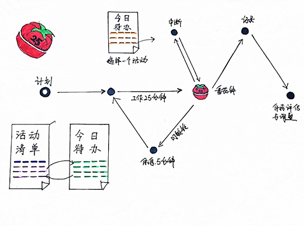
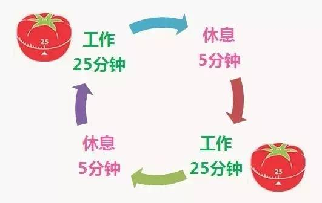

  

# 番茄时间管理法介绍 Introduction of the Pomodoro Technique

> 本次介绍的主要内容
番茄管理法试图解决的一些问题
使用番茄管理法--基础
使用番茄管理法--进阶

## 番茄管理法试图解决的一些问题
* **面对复杂，望而却步**
* 无聊琐事，越拖越久
- 小事忙活一天，大事一样没办
- 最后期限，步步紧逼
- 一错再错，不长记性
 

### 番茄管理法的历史

>弗朗西斯科·西里洛(意大利人)在1992年创立了番茄工作法。他在大学时苦于效率低下，作业做不出来，学习学不进去。最终找到了一枚厨房定时器，形状好像番茄(即意大利语的Pomodoro)。

## 使用番茄管理法--基础
  

    
  

  
**活动清单**
  无论是否重要，不必考虑重要程度和优先级，也不必写出具体做法，只写完成后的状态，可以在后面标注最后期限
  - 学习Java
  - 学习番茄工作法图解
  - 看世界杯
  - 健身

**今日待办**
  "今日待办"表格是在时间段内限定的承诺。在这张表格中，只让你看到今天可以达到的目标。
  事项的重要程度应该
  活动清单里的事情，别一股脑都抄到"今日待办"表格里，要考虑全部做完的承诺是否合理。

**开始番茄时钟循环**
在明确了今日待办之后，就可以开始设定一个25分钟的定时器。
  

    
  

**工作**
在一个番茄时钟内，保持专注。
不要在番茄钟进行中切换到另一项活动。
关键不在于当前活动是否能在当前番茄钟内完成，而是在这一刻尽了全力
完成后在今日待办相应的活动旁边画一个X。

**休息**
在休息期间，思考上一个番茄钟或者下一个番茄钟的工作是不允许的。
  > 推荐
  >* 睡觉
  >* 溜达
  >* 喝水
  >* 看窗外

  > 不要  
  >* 打电话
  >* 看新闻
  >* 回电邮
  >* 工作

## 使用番茄管理法--进阶
### 中断
#### 内部终端
#### 外部中断
###预估

## 如何使番茄时间管理法真正起作用(个人心得)
> **注意事项** 
  > 1.对自己诚实，无论今天番茄时间完成的如何，把状态可视化
  > 2.通过一段时间的记录，更客观的预估今日待办
  > 3. 

## 工具

1. 机械番茄钟
  

    
  

2. 电子番茄钟
  

    
  

3. 手机App

  安卓[番茄ToDo](http://shouji.baidu.com/software/24228848.html)
  苹果[番茄清单 - 提高效率的奇妙番茄工作法](https://itunes.apple.com/cn/app/id1150993112?mt=8)

## 参考书籍
* [番茄工作法图解](https://item.jd.com/10406129.html)
* [番茄工作法简介：基本流程](https://www.jianshu.com/p/d1e3df65d814)
* [我为什么要使用番茄工作法？](https://www.jianshu.com/p/27989c8642a6)
